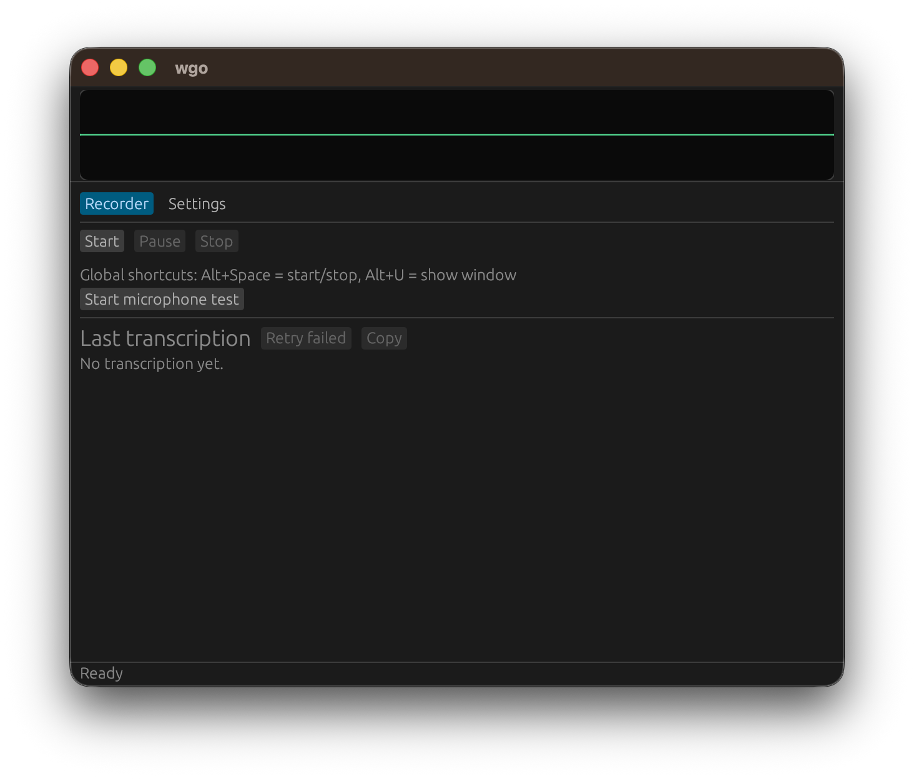
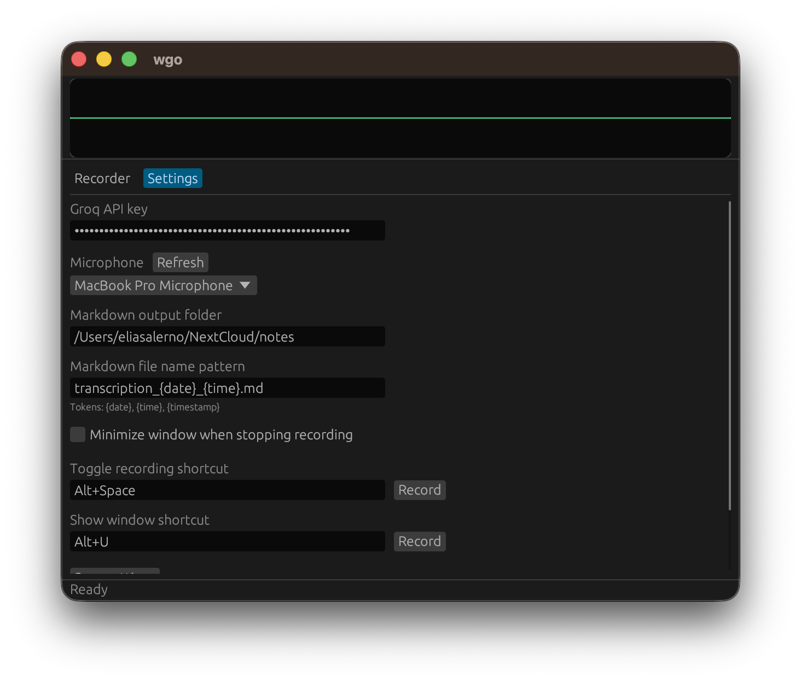
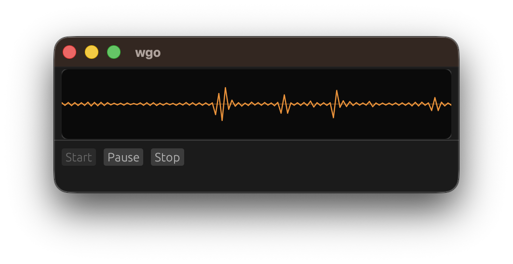
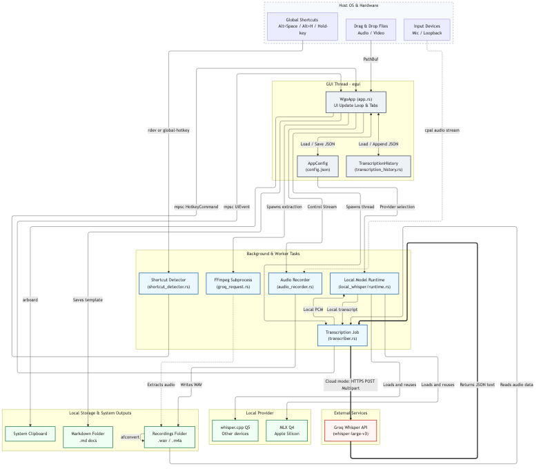

# wgo

A lightweight, cross-platform voice transcription utility designed for seamless dictation and automated note-taking. Built with pure Rust and `egui`, `wgo` captures system or microphone audio, processes media file imports, and transcribes them directly to your system clipboard and local workspace using **local, on-device Whisper models** (with native Apple Silicon MLX GPU acceleration or whisper.cpp fallback) or **Groq Cloud API**.

<table>
  <tr>
    <td></td>
    <td></td>
    <td></td>
  </tr>
</table>

---

## Capabilities

*   **Local-First & Cloud Transcription**: Transcribe 100% on-device with zero data leaving your computer. On macOS Apple Silicon, models run natively on the unified memory GPU via native MLX (`mlx-rs`) using `mlx-community/whisper-large-v3-turbo-q4`. On Intel Macs, Linux and Windows, high-performance quantized inference is provided via `whisper.cpp` bindings (`whisper-rs`). Or switch to the Groq Cloud API anytime for remote processing.
*   **Automatic Bidirectional Fallback**: Never lose a transcription. If Local is primary and fails, `wgo` automatically falls back to Groq; if Groq is primary and fails (offline, rate limits, API key errors), it automatically falls back to Local. Active backends, fallback readiness, and fallback events are dynamically indicated in the window title and top bar badge.
*   **One-Click Model Downloader**: Download and manage local Whisper models (`whisper-large-v3-turbo`) directly in the Settings tab with a "Download all" button, per-model controls, and real-time download speed and progress tracking.
*   **Versatile Audio Routing**: Supports capturing from standard microphone hardware, direct desktop loopback audio, or both simultaneously (microphone + desktop mix). 
*   **Dictation & Hold-to-Record**: Dictate your thoughts naturally with custom hotkeys. In addition to a global toggle, the app supports physical **Hold-to-Record** keys (such as `ControlLeft` or `AltGr`). The recording runs only as long as you hold the key down and instantly transcribes upon release.
*   **Drag-and-Drop Media Processing**: Drop existing audio or video files directly into the window. For video formats, `wgo` automatically leverages local `ffmpeg` in a background subprocess to extract and compress the audio stream to a space-efficient format before transcription.
*   **Automated Clipboard & Note Export**: Transcriptions are copied to your system clipboard the moment they are ready. Simultaneously, `wgo` generates clean Markdown files in a customizable output directory using custom tokenized patterns (e.g., `transcription_{date}_{time}.md`) complete with metadata YAML frontmatter.
*   **Local History & Playback**: Browse, copy, or open previous note files directly within the application. The append-only historical database retains file paths allowing you to play back original recorded source files or reveal them in your system's file manager.
*   **Hardware Native & Cross-Platform**: Package builds are available for macOS, Linux, and Windows, offering platform-native styling and exceptionally low memory footprint. Pure compiled native binaries—no Python runtime required.

---

## Technical Architecture

The diagram below maps out how `wgo` isolates background worker threads and subprocesses from the primary GUI rendering thread, ensuring a smooth, non-blocking UI:



---

## Installation

### Binary Releases
Packaged releases for your system (including a signed macOS `.app` bundle, a Windows portable executable `.exe`, and a Linux Debian `.deb` package) can be downloaded from the **Releases** tab.

### Installing with Cargo
If you have a local Rust toolchain configured, you can install the utility directly from GitHub:

```bash
cargo install --git https://github.com/salernoelia/wgo
```

To compile manually from source:

```bash
git clone https://github.com/salernoelia/wgo.git
cd wgo
cargo build --release
```
The compiled binary will be located in the `target/release/` directory.

### Prerequisites (For Video Transcription)
While voice dictation relies entirely on internal audio engines, drag-and-drop **video transcription** requires a system installation of `ffmpeg` to extract and process audio tracks.
*   **macOS**: `brew install ffmpeg`
*   **Linux**: `sudo apt install ffmpeg`
*   **Windows**: Download and add `ffmpeg` to your system `PATH`.

---

## Data Privacy & System Integration

### System Permissions
*   **macOS Accessibility**: On macOS, global keyboard listeners that hook outside the focused window require Accessibility permissions. To use **Hold-to-Record** or customized background hotkeys, you will be prompted to allow `wgo` in `System Settings → Privacy & Security → Accessibility`.
*   **Desktop Audio Capture**: Capturing desktop audio on Windows and Linux relies on your system’s active output device configuration. On macOS, system capture requires setting up a virtual loopback device (such as the open-source **BlackHole** driver) and selecting it as the capture source in the settings tab.

### Local Storage Structure
Your recordings, system config, models, and history remain strictly under your control. By default, `wgo` structures files in platform-native local paths:

| Platform | Configuration (`config.json`) | Whisper Models (`models/`) | Recordings Directory | Local Database (`history.json`) |
| :--- | :--- | :--- | :--- | :--- |
| **macOS** | `~/Library/Application Support/wgo/` | `~/Library/Application Support/wgo/models/` | `~/Documents/wgo-recordings/` | `~/Library/Application Support/wgo/` |
| **Linux** | `~/.config/wgo/` | `~/.local/share/wgo/models/` | `~/Documents/wgo-recordings/` | `~/.local/share/wgo/` |
| **Windows** | `%LOCALAPPDATA%\wgo\` | `%LOCALAPPDATA%\wgo\models\` | `%USERPROFILE%\Documents\wgo-recordings\` | `%APPDATA%\wgo\` |

### Privacy & Transmission
*   **Local Provider (Default)**: Audio processing and Whisper inference happen completely on your device. Zero audio data, recordings, or transcriptions ever leave your machine.
*   **Groq Cloud Provider**: If you switch to Groq, audio files are sent directly to the Groq Whisper API securely over HTTPS using your private API key.
*   The application contains zero telemetry or secondary tracking platforms.

---

## Usage

Start the app from your application launcher or your terminal:

```bash
wgo
```

### Getting Started
1. **Local Mode (Default)**: Open the **Settings** tab and click **Download Model** under the Local Whisper section. Once downloaded, all voice recordings and dropped media are transcribed 100% offline on your machine.
2. **Groq Mode**: If you prefer cloud transcription, switch the provider to **Groq** in Settings and enter your API key from the [Groq Console](https://console.groq.com/).

### Default Global Controls

*   <kbd>Alt</kbd> + <kbd>Space</kbd> (or <kbd>Cmd</kbd> + <kbd>Space</kbd> on macOS): **Start / Stop Recording**
*   <kbd>Alt</kbd> + <kbd>H</kbd>: **Show / Hide Main Window**
*   <kbd>Control</kbd> (Hold): **Hold-to-Record** (The app records while held, then stops and transcribes upon release)

*Shortcuts and behavior (such as auto-minimizing on stop) can be fully remapped or disabled in the Settings tab.*

## License

This project is licensed under the [MIT License](LICENSE).
### Native local transcription verification

Download models in Settings → Local Models. Apple Silicon offers MLX Large v3
Turbo Q4 (~467 MB including tokenizer); other devices offer whisper.cpp Large
v3 Turbo Q5. An old Whisper Tiny download does not count as the MLX model.
MLX is preferred when installed; inference errors are reported without silently
switching models. Both engines compile into the executable, with no Python or
external inference process. Model weights remain separate downloads.

To run an engine explicitly (without the GUI or cloud fallback):

```sh
cargo build --release
./target/release/wgo --transcribe-local mlx recording.wav
./target/release/wgo --transcribe-local whisper-cpp recording.wav
cargo test --release local_whisper
cargo test --release local_whisper -- --ignored --nocapture --test-threads=1
```

Set `WGO_TEST_AUDIO` to override the integration tests' recording path. These
recording tests require installed models and fail if a prerequisite is missing.
The separate `download_mlx_and_transcribe` test downloads a fresh model (~467 MB).
WAV decoding and resampling are native Rust; other imported media formats retain
the existing ffmpeg requirement. MLX kernel sources and the remaining precompiled
Metal library are embedded in the executable by the vendored `mlx-sys` patch.
No runtime extraction or separate `mlx.metallib` is needed.
